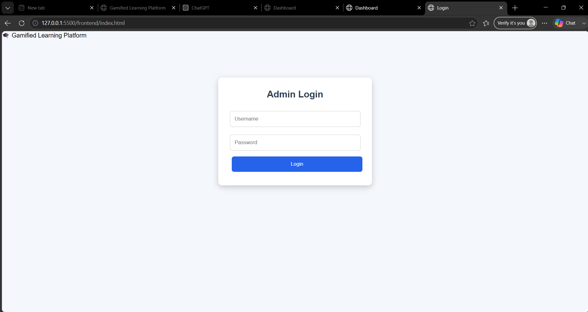
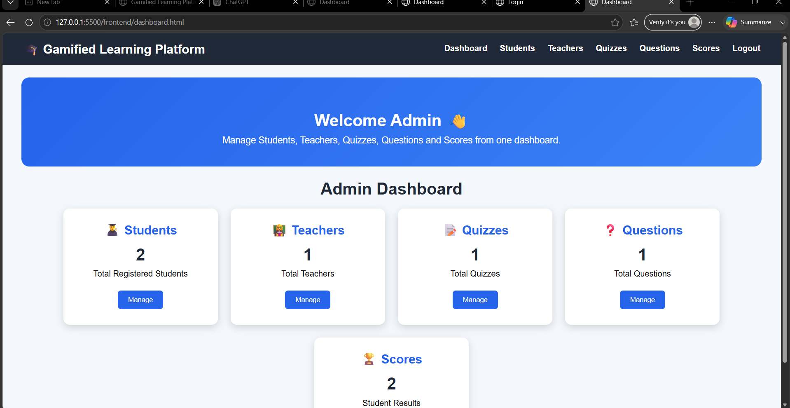
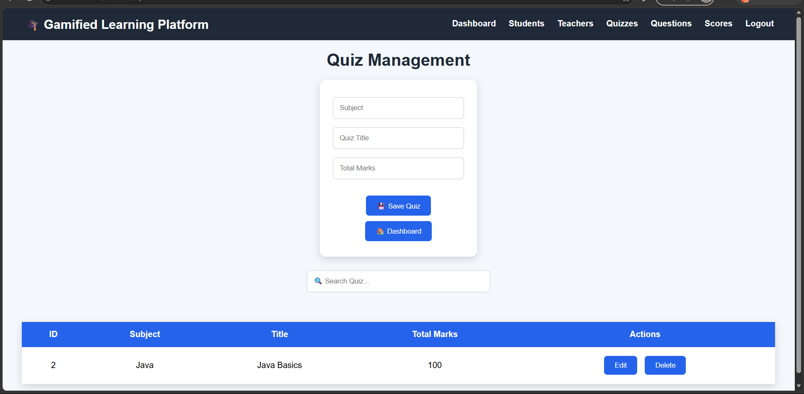
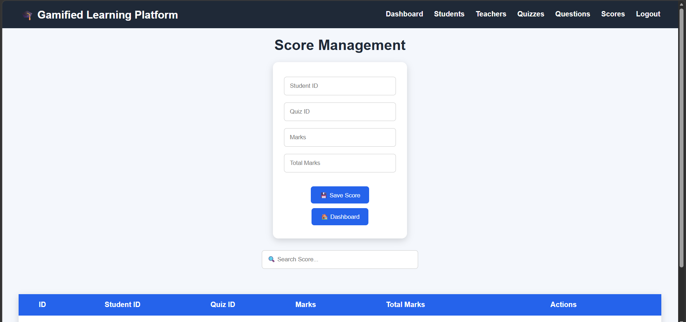

# Gamified Learning Platform for Rural Education

## Project Overview
A web-based gamified learning platform designed to improve rural education by providing interactive quizzes, student progress tracking, and teacher management features.

## Features

### Student Module
- Student registration and management
- View quizzes
- Attempt questions
- Track scores

### Teacher Module
- Teacher management
- Create and manage quizzes
- Monitor student performance

### Quiz Module
- Add quizzes
- Manage questions
- Evaluate scores

## Technologies Used

### Backend
- Java
- Spring Boot
- Spring Data JPA
- MySQL

### Frontend
- HTML
- CSS
- JavaScript

### Tools
- Git & GitHub
- Postman
- IntelliJ IDEA / VS Code

## Project Structure
Gamified-Learning-Platform
│
├── backend
│ └── Spring Boot Application
│
└── frontend
├── HTML Pages
├── CSS
└── JavaScript

## How to Run

### Backend
1. Open backend folder
2. Configure database in `application.properties`
3. Run Spring Boot application

### Frontend
Open `index.html` in browser.

## Future Enhancements
- User authentication
- Gamification badges
- Leaderboard
- AI-based personalized learning
## Screenshots

### Login Page

### Dashboard

### Quiz Module

### Score Tracking
